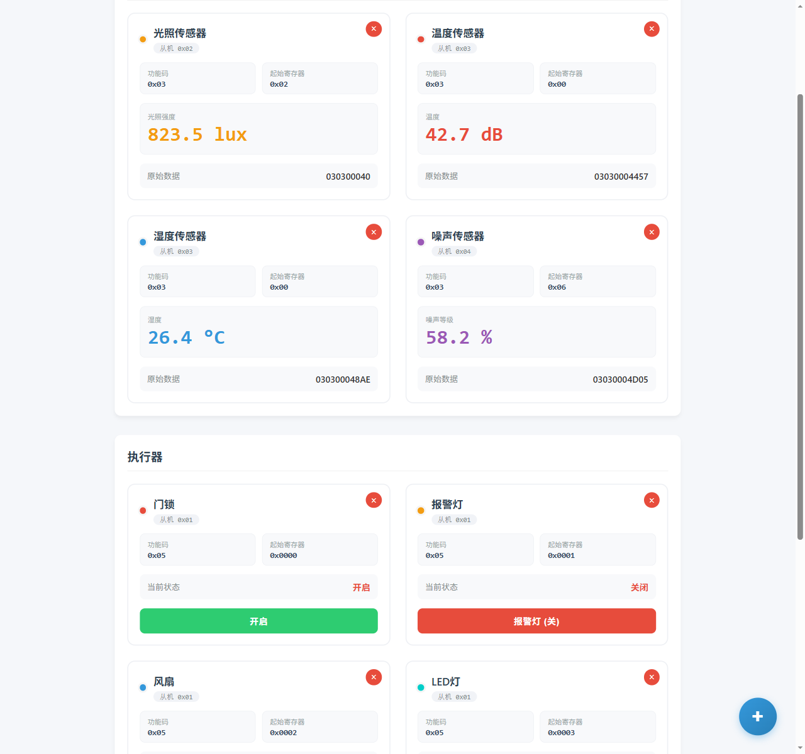
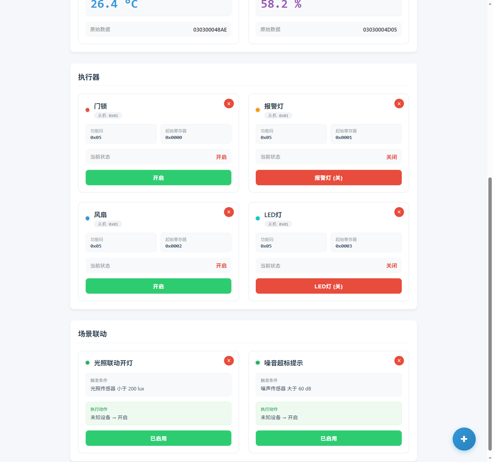
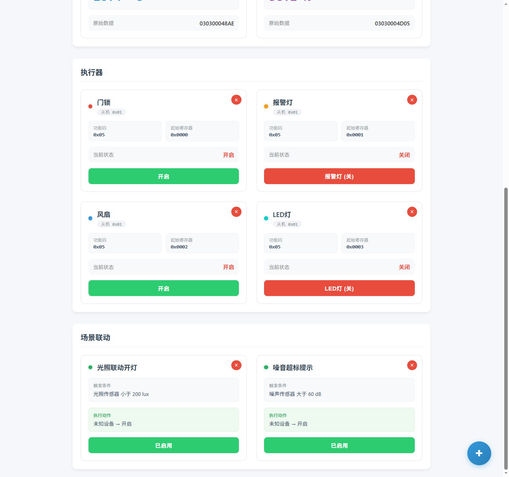
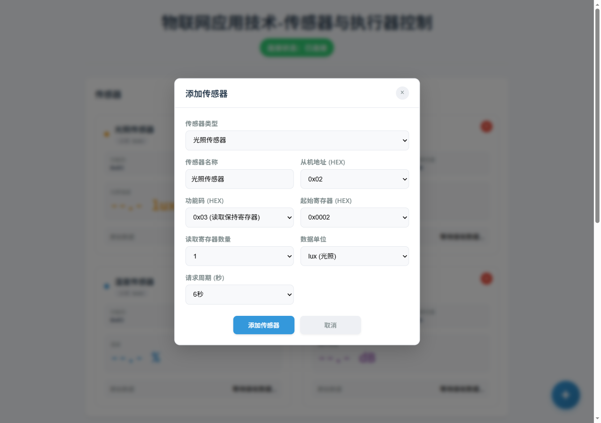
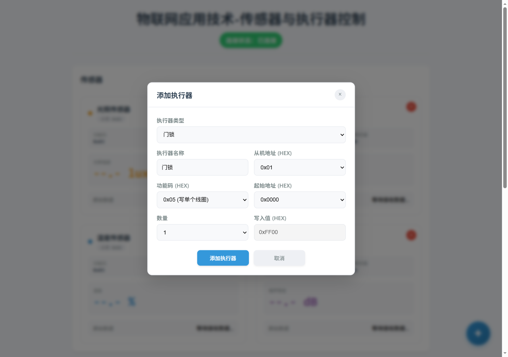
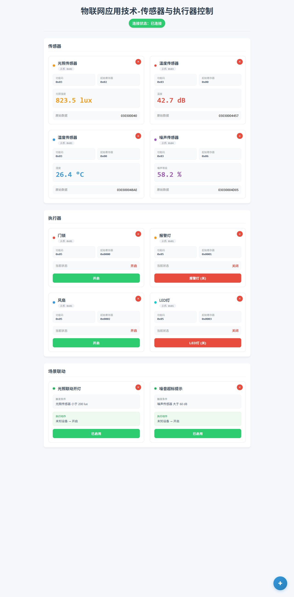

# 物联网传感器与执行器控制平台

基于 **MQTT + Modbus RTU** 协议的物联网设备监控与控制 Web 应用。支持传感器数据实时采集展示、执行器远程开关控制、场景联动自动化，采用整洁架构分层设计。


---

## 目录

- [项目简介](#项目简介)
- [技术栈](#技术栈)
- [功能特性](#功能特性)
- [界面预览](#界面预览)
- [项目架构](#项目架构)
- [快速开始](#快速开始)
- [测试](#测试)
- [目录结构](#目录结构)
- [文档](#文档)
- [技术亮点](#技术亮点)

---

## 项目简介

本项目是一个完整的物联网设备控制前端，通过 MQTT 与现场网关通信，网关将数据透传为 Modbus RTU 协议，实现对 15 类传感器（光照、温湿度、噪声、压力、CO2、水位、流量等）的实时监测，以及对 17 类执行器（门锁、报警灯、风扇、电机、水泵等）的远程控制。

支持**场景联动**：当传感器数据满足条件（如光照低于阈值）时自动触发执行器动作（如开启 LED 灯）。

## 技术栈

| 分类 | 技术 |
|---|---|
| 构建工具 | Vite |
| 语言 | 原生 JavaScript（ES Modules，无框架） |
| 测试 | Vitest |
| 通信协议 | MQTT over WebSocket（Paho）、Modbus RTU |
| 持久化 | localStorage（设备配置与状态缓存） |
| 架构 | 整洁架构四层分层 + SOLID 原则 |

## 功能特性

- **传感器实时监控**：15 种传感器预设，数值实时刷新，异常响应卡片高亮提示
- **执行器远程控制**：17 种执行器预设，一键开关，状态即时反馈
- **场景联动自动化**：可视化配置"传感器条件 → 执行器动作"，自动触发
- **设备自定义扩展**：支持自定义添加传感器/执行器（从机地址、功能码、寄存器自由配置）
- **配置持久化**：设备列表与状态自动缓存到本地，刷新不丢失
- **请求去重轮询**：相同 Modbus 请求共享轮询定时器，避免冗余通信
- **粘包/拆包处理**：MQTT 消息与 Modbus 帧边界不对应，内置 CRC 校验解码器

## 界面预览

> 截图数值为演示数据，实际运行时为 MQTT 实时数据。

**传感器监控**



**执行器控制**



**场景联动**



**自定义添加设备**





**整页视图**



## 项目架构

采用整洁架构（Clean Architecture）四层分层，依赖方向严格单向：

```
表现层(ui/) → 用例层(core/) → 适配层(adapters/) → 实体层(entities/)
```

```
src/
├── main.js              ← 装配根：唯一跨层 import 入口，依赖注入
├── core/                ← 用例层：业务逻辑、Modbus 协议纯函数
├── adapters/            ← 适配层：MQTT 网关、本地存储
├── entities/            ← 实体层：15 传感器 + 17 执行器预设配置
└── ui/                  ← 表现层：DOM 渲染、弹窗交互
```

**核心设计原则**：

- **依赖倒置**：核心层不依赖任何外部实现，适配器通过构造函数注入，可整体替换（如换 WebSocket 无需改动业务层）
- **开闭原则**：新增传感器/执行器只需在 `entities/presets.js` 添加配置，无需修改协议层或用例层
- **事件驱动解耦**：用例层与表现层通过事件总线通信，互不直接引用

## 快速开始

```bash
# 1. 配置环境变量（可选，不配置则使用非敏感默认值）
cp .env.example .env   # 填写 MQTT 服务器地址与认证信息

# 2. 安装依赖
npm install

# 3. 启动开发服务器（默认 http://localhost:5173）
npm run dev

# 4. 生产构建
npm run build
```

**Windows 一键启动**：双击 `start.bat`，自动安装依赖并启动（可选 `dev` / `build` / `check` 模式）。

### 环境变量（`.env`）

| 变量 | 说明 |
|---|---|
| `VITE_MQTT_SERVER` | MQTT 服务器地址 |
| `VITE_MQTT_PORT` | WebSocket 端口（默认 8083） |
| `VITE_MQTT_SUBSCRIBE_TOPIC` | 订阅主题（传感器数据） |
| `VITE_MQTT_PUBLISH_TOPIC` | 发布主题（执行器控制） |
| `VITE_MQTT_USERNAME` / `VITE_MQTT_PASSWORD` | MQTT 认证信息 |
| `VITE_MQTT_USE_SSL` | 是否启用 TLS（`true`/`false`） |

> 模板见 `.env.example`。`.env` 已被 `.gitignore` 排除，敏感凭据不会进入仓库。纯前端部署下浏览器侧仍可见凭据，生产环境建议由服务端代理或网关鉴权。

## 测试

69 个测试用例全部通过，覆盖协议层与用例层：

```bash
npm test     # 运行全部测试
npm run check  # 测试 + 构建
```

- 协议层：CRC 计算、帧编解码、粘包解码器（35 例，纯函数单元测试）
- 传感器用例层：轮询去重、值提取、事件分发（13 例，Mock 适配器集成测试）
- 场景用例层：条件判定、触发执行（21 例）

## 目录结构

```
物联网传感器与执行器控制/
├── src/               # 源码
│   ├── main.js        # 装配根
│   ├── core/          # 用例层（协议纯函数 + 业务服务）
│   ├── adapters/      # 适配层（MQTT / 存储）
│   ├── entities/      # 实体层（设备预设配置）
│   └── ui/            # 表现层（视图 / 弹窗 / 格式化）
├── tests/             # 单元测试与集成测试
├── docs/              # 设计文档
├── public/            # 静态资源（MQTT 库 / favicon）
├── screenshots/       # 界面预览截图
├── ARCHITECTURE.md    # SOLID 与整洁架构规范
├── AGENTS.md          # 项目开发规则
└── start.bat          # Windows 一键启动脚本
```

## 文档

| 文档 | 说明 |
|---|---|
| [docs/protocol.md](docs/protocol.md) | Modbus RTU 协议设计、MQTT 数据流、设备配置格式 |
| [docs/testing.md](docs/testing.md) | 测试策略、用例分布、Mock 原则 |
| [ARCHITECTURE.md](ARCHITECTURE.md) | SOLID 原则与整洁架构规范（通用版） |
| [AGENTS.md](AGENTS.md) | 项目开发规则（分层约束、代码规范） |

## 技术亮点

1. **协议层工程化**：Modbus RTU 编解码全部提炼为纯函数（无副作用、可单测），修复了原始实现中多个 CRC 错误与异常帧解析 bug
2. **粘包/拆包解码器**：针对 MQTT 消息边界与 Modbus 帧边界不一致的实际问题，实现了基于帧长度规则 + CRC 校验滑动窗口的解码器，支持粘包、拆包、噪音恢复
3. **请求去重轮询**：相同请求配置的传感器共享轮询定时器，降低通信开销
4. **配置驱动扩展**：新增设备类型零修改业务代码（开闭原则落地）
5. **完整测试体系**：69 个测试覆盖协议与业务逻辑，Mock 基于接口约定